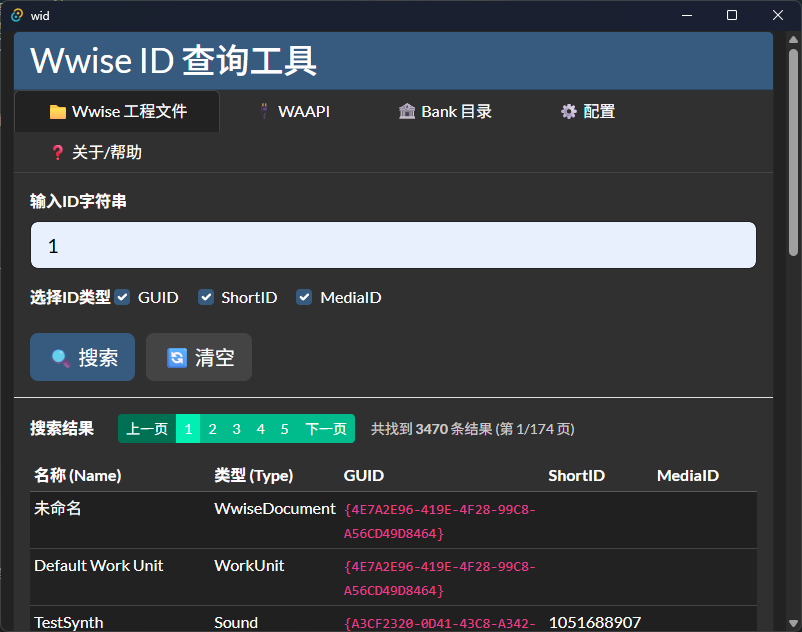

# WID - Wwise ID 查询工具

<div align="center">


**高效的 Wwise 音频资源 ID 查询和管理工具**

[功能特点](#-功能特点) • [安装说明](#-安装说明) • [使用方法](#-使用方法) • [配置指南](#-配置指南) • [开发指南](#-开发指南)

</div>

---

## 📋 项目简介

WID (Wwise ID) 是一个专门为音频开发者设计的桌面应用程序，旨在简化 Wwise 音频项目中的 ID 查询和管理工作。该工具支持多种查询方式，包括本地 Wwise 工程文件查询、WAAPI 实时查询和 SoundBank 文件查询。

> **平台支持**: 目前仅支持 Windows 10/11 平台  
> **测试版本**: 已在 Wwise 2024 上完成测试和验证

## 📸 软件截图

<div align="center">



*WID 主界面 - 多标签页设计，支持 Wwise 工程文件、WAAPI 实时查询、Bank 目录查询*

</div>

### 🎯 解决的问题

- **ID 查询困难**: 在大型音频项目中快速定位特定的 GUID、ShortID 或 MediaID
- **多环境切换**: 不同项目和环境间的配置管理和快速切换
- **效率提升**: 减少在 Wwise Authoring Tool 中手动查找的时间
- **团队协作**: 为音频设计师和程序员提供统一的 ID 查询接口

## ✨ 功能特点

### 🔍 多源查询支持
- **📁 Wwise 工程文件查询**: 直接解析 `.wproj` 文件和相关的 XML 资源
- **🔌 WAAPI 实时查询**: 通过 WebSocket 连接到 Wwise Authoring Tool 进行实时查询
- **🏦 SoundBank 查询**: 解析 `SoundbanksInfo.xml` 和 JSON 格式的 Bank 文件

### 🎛️ 灵活的查询选项
- **GUID 查询**: 查找全局唯一标识符
- **ShortID 查询**: 查找短整型 ID
- **MediaID 查询**: 查找媒体文件 ID
- **组合查询**: 支持同时查询多种 ID 类型

### 💾 智能配置管理
- **多配置保存**: 为不同项目保存独立的配置文件
- **一键切换**: 快速在不同环境配置间切换
- **自动恢复**: 应用启动时自动加载上次使用的配置

### 📊 高效结果展示
- **分页显示**: 大量结果的分页浏览，提升性能
- **详细信息**: 显示资源名称、类型、各种 ID 信息
- **即时搜索**: 输入即时查询，无需等待

## 🚀 安装说明

### 系统要求
- **操作系统**: Windows 10/11 (当前仅支持 Windows 平台)
- **Wwise 版本**: 已在 Wwise 2024 上测试，其他版本可能需要额外配置
- **内存**: 最少 512MB RAM
- **存储**: 约 50MB 可用空间

### 下载安装
1. 前往 [Releases](https://github.com/xmimu/wid/releases) 页面
2. 下载 Windows 版本的安装包：
   - `wid_x.x.x_x64.msi` (推荐) 或 `wid_x.x.x_x64.exe`
3. 运行安装程序并按照提示完成安装

> **注意**: 目前本工具仅在 Windows 平台上开发和测试，macOS 和 Linux 版本暂不提供支持。

### 开发版安装

> **开发环境要求**: 需要 Windows 10/11 + Rust 1.70+ + Node.js 18+

```bash
# 克隆仓库
git clone https://github.com/xmimu/wid.git
cd wid

# 安装依赖
pnpm install

# 启动开发服务器
pnpm tauri dev

# 构建生产版本
pnpm tauri build
```

## 📖 使用方法

### 基本操作流程

1. **启动应用**: 双击桌面图标或从开始菜单启动
2. **选择查询模式**: 在顶部标签页中选择查询方式
3. **配置连接**: 在"配置"标签页设置相应的路径或连接信息
4. **执行查询**: 输入要查询的 ID，选择 ID 类型，点击搜索
5. **查看结果**: 在结果表格中浏览查询结果

### 📁 Wwise 工程文件查询

适用于离线查询本地 Wwise 项目文件。

1. 切换到"Wwise 工程文件"标签页
2. 在配置中设置 Wwise 工程目录（包含 `.wproj` 文件的目录）
3. 输入要查询的 ID 字符串
4. 选择要查询的 ID 类型（GUID、ShortID、MediaID）
5. 点击"🔍 搜索"按钮

### 🔌 WAAPI 实时查询

适用于与正在运行的 Wwise Authoring Tool 进行实时交互。

#### 配置 Wwise WAAPI 服务

1. 在 Wwise Authoring Tool 中打开用户首选项：
   - 菜单栏选择 **Project → User Preferences...** 或使用快捷键 **Shift+U**
   
2. 启用 WAAPI 服务：
   - 在 **Wwise Authoring API (WAAPI)** 部分
   - 勾选 **Enable Wwise Authoring API** 复选框
   
3. 配置跨域访问（重要！）：
   - 在 **Allow browser connections from** 输入框中添加允许的源地址
   - 推荐配置：
     ```
     http://tauri.localhost,https://tauri.localhost,http://127.0.0.1:1430
     ```
   - 或者使用通配符：`*`（不推荐在生产环境使用）


4. 确认端口配置：
   - **WAMP port**: 默认 8080（用于 WebSocket 连接）
   - **HTTP port**: 默认 8090（用于 HTTP 请求）

5. 点击 **OK** 保存配置并重启 Wwise Authoring Tool 使配置生效

#### 使用 WAAPI 查询

1. 确保 Wwise Authoring Tool 已启动并完成上述 WAAPI 配置
2. 切换到"WAAPI"标签页
3. 在配置中设置正确的 Host 和 Port（通常是 `127.0.0.1:8080`，注意使用 **WAMP 端口** 而非 HTTP 端口）
4. 点击"🧪 测试连接"确认连接状态
5. 执行查询操作

> 💡 **提示**: 如果连接失败，请检查 Wwise 防火墙设置，确保端口 8080 未被阻止

### 🏦 SoundBank 查询

适用于查询已生成的 SoundBank 文件信息。

1. 切换到"Bank 目录"标签页
2. 在配置中设置包含 `SoundbanksInfo.xml` 或 JSON 文件的目录
3. 执行查询操作

## ⚙️ 配置指南

### 配置管理功能

应用提供了强大的多配置管理功能，让您可以为不同的项目或环境保存独立的配置。

#### 保存配置
1. 设置好所有必要的路径和连接信息
2. 在"配置管理"区域的"保存新配置"输入框中输入配置名称
3. 点击"💾 保存"按钮

#### 加载配置
1. 在"当前配置"下拉列表中选择要使用的配置
2. 点击"📂 加载"按钮，所有配置项会自动更新

#### 删除配置
1. 在下拉列表中选择要删除的配置
2. 点击"🗑️ 删除"按钮并确认

### 配置项说明

| 配置项 | 描述 | 示例 |
|--------|------|------|
| Wwise 工程目录 | 包含 `.wproj` 文件的目录路径 | `C:\Projects\MyGame\WwiseProject` |
| WAAPI Host | WAAPI 服务器地址 | `127.0.0.1` |
| WAAPI Port | WAAPI 服务器端口 | `8080` |
| Bank 目录 | 包含 SoundbanksInfo 文件的目录 | `C:\Projects\MyGame\Soundbanks` |

## 🛠️ 开发指南

### 技术栈
- **前端**: HTML5, CSS3, JavaScript (Vanilla)
- **桌面框架**: Tauri 2.0
- **后端**: Rust
- **UI 框架**: Bootstrap 5
- **通信**: WAAPI (WebSocket)

### 项目结构
```
wid/
├── src/                    # 前端源码
│   ├── index.html         # 主页面
│   ├── css/               # 样式文件
│   ├── js/                # JavaScript 逻辑
│   │   ├── main.js        # 主应用逻辑
│   │   ├── waapi.js       # WAAPI 连接封装
│   │   └── waapi-query.js # WAAPI 查询模块
│   └── lib/               # 第三方库
├── src-tauri/             # Tauri 后端
│   ├── src/               # Rust 源码
│   │   ├── main.rs        # 主程序入口
│   │   ├── lib.rs         # 库入口
│   │   └── modules/       # 功能模块
│   │       ├── wwise_search.rs    # Wwise 查询模块
│   │       ├── bank_search.rs     # Bank 查询模块
│   │       └── utils.rs           # 工具函数
│   ├── Cargo.toml         # Rust 依赖配置
│   └── tauri.conf.json    # Tauri 配置
├── package.json           # 前端依赖配置
└── README.md             # 项目文档
```

### 开发环境配置

1. **安装 Rust**
   ```bash
   curl --proto '=https' --tlsv1.2 -sSf https://sh.rustup.rs | sh
   ```

2. **安装 Node.js 和 pnpm**
   ```bash
   # 使用 Node.js 18+
   npm install -g pnpm
   ```

3. **安装 Tauri CLI**
   ```bash
   pnpm add -D @tauri-apps/cli
   ```

4. **克隆并运行项目**
   ```bash
   git clone https://github.com/xmimu/wid.git
   cd wid
   pnpm install
   pnpm tauri dev
   ```

### 构建发布版本

```bash
# 构建所有平台
pnpm tauri build

# 仅构建当前平台
pnpm tauri build --target current

# 构建特定平台 (需要相应的工具链)
pnpm tauri build --target x86_64-pc-windows-msvc
pnpm tauri build --target x86_64-apple-darwin
pnpm tauri build --target x86_64-unknown-linux-gnu
```

## 🤝 贡献指南

我们欢迎社区贡献！如果您想为项目做出贡献，请遵循以下步骤：

1. Fork 本仓库
2. 创建您的功能分支 (`git checkout -b feature/AmazingFeature`)
3. 提交您的更改 (`git commit -m 'Add some AmazingFeature'`)
4. 推送到分支 (`git push origin feature/AmazingFeature`)
5. 打开一个 Pull Request

### 开发规范
- 使用 `rustfmt` 格式化 Rust 代码
- 使用 `prettier` 格式化前端代码
- 为新功能添加测试
- 更新相关文档

## 📝 许可证

本项目采用 [MIT 许可证](LICENSE) - 详细信息请查看 LICENSE 文件。

## 🙏 致谢

- [Tauri](https://tauri.app/) - 提供了优秀的桌面应用开发框架
- [Bootstrap](https://getbootstrap.com/) - 提供了美观的 UI 组件
- [Wwise](https://www.audiokinetic.com/products/wwise/) - 为音频开发提供了强大的工具链
- 所有为本项目做出贡献的开发者们

## 📞 支持与反馈

如果您在使用过程中遇到问题或有改进建议，请通过以下方式联系我们：

- **Issues**: [GitHub Issues](https://github.com/xmimu/wid/issues)
- **Discussions**: [GitHub Discussions](https://github.com/xmimu/wid/discussions)
- **Email**: [1101588023@qq.com](mailto:1101588023@qq.com)

## 💝 支持项目

如果这个工具对您有帮助，欢迎通过以下方式支持项目发展：

### ☕ 请我喝杯咖啡

<div align="center">


**微信扫码捐赠**

</div>

### 🌟 其他支持方式

- ⭐ 给项目点个 Star
- 🐛 反馈 Bug 和建议
- 📢 推荐给其他 Wwise 开发者
- 🤝 贡献代码和文档

> 💡 **说明**: 捐赠完全自愿，无论是否捐赠都不会影响软件的使用。您的每一份支持都是对开发者的鼓励！

---

<div align="center">

**如果这个项目对您有帮助，请给我们一个 ⭐**

Made with ❤️ by [xmimu](https://github.com/xmimu)

</div>
